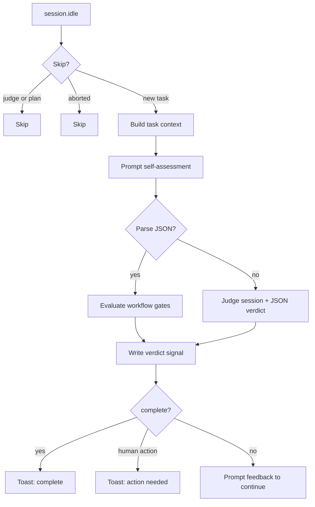

# Reflection Plugin (reflection-3)

Evaluates agent task completion and enforces workflow requirements using a self-assessment prompt plus optional GenAI verification.

## Scope
- Trigger on `session.idle`.
- Skip judge sessions, plan mode sessions, and recently aborted sessions.
- Avoid repeated reflections for the same user message.
- Build a task context from recent messages, tool usage, and repo signals.
- Request a structured self-assessment from the agent.
- Parse JSON self-assessment and evaluate workflow gates.
- If self-assessment parsing fails, fall back to a judge session and parse a JSON verdict.
- Write verdict signals to `.reflection/verdict_<session>.json` for TTS/Telegram gating.
- Persist reflection analysis data to `.reflection/<session>_<timestamp>.json`.
- Provide feedback only when incomplete; show a toast when complete or when user action is required.

## Configuration
Reflection models are configured in `~/.config/opencode/reflection.yaml`.

Example:
```yaml
models:
  - github-copilot/claude-opus-4.6
  - github-copilot/gpt-5.2-codex
```

Notes:
- Each entry must be `providerID/modelID`.
- The plugin will try each model in order until one returns a valid verdict.
- If all models fail or time out, reflection returns a failure verdict.

Custom prompt override:
- Place `reflection.md` in the workspace root.

Debug logging:
- `REFLECTION_DEBUG=1`

## Workflow Gates (reflection-3)
reflection-3 enforces workflow gates using the self-assessment plus GenAI verification:

- Task must be complete and explicitly confirmed by the agent.
- Required local tests must run and pass, and the exact commands must be listed.
- Tests cannot be skipped for reasons like flakiness or “not important”.
- PR creation is required; direct pushes to `main`/`master` are rejected.
- PR link, PR creation evidence, and CI checks must be verified as passing (recommend `gh pr checks` or `gh pr view`).

If any of these gates are missing, reflection will mark the task incomplete and push the agent to continue.

## Self-Assessment Contract
The agent must return JSON with evidence and status, including:
- `tests.ran`, `tests.results`, `tests.ran_after_changes`, `tests.commands`
- `build.ran`, `build.results`
- `pr.created`, `pr.url`, `pr.ci_status`, `pr.checked`
- `remaining_work`, `next_steps`, `needs_user_action`
- `stuck`, `alternate_approach`

## Decision Outcomes
- Complete -> toast success, write verdict signal.
- Requires human action -> toast warning, no follow-up prompt.
- Incomplete -> push feedback into the session with next steps.

## System Design Diagram


## Files and Artifacts
- `<workspace>/.reflection/verdict_<session>.json` (signal for TTS/Telegram)
- `<workspace>/.reflection/<session>_<timestamp>.json` (full analysis record)
- `~/.config/opencode/reflection.yaml` (judge model list)
- `reflection.md` in workspace (optional custom prompt)

## Task-Based Model Routing

When reflection determines a task is incomplete and pushes feedback, it can optionally route the retry to a model best suited for the task type. This is configured via a `routing:` section in `~/.config/opencode/reflection.yaml`.

### Configuration

```yaml
models:
  - github-copilot/claude-opus-4.6

routing:
  enabled: true
  models:
    backend: github-copilot/gpt-5.2-codex
    architecture: github-copilot/claude-opus-4.6
    frontend: github-copilot/gemini-3-pro-preview
    default: ""  # empty = use session default model
```

### Task Categories

| Category | Routing target | Matches |
|---|---|---|
| **backend** | `gpt-5.2-codex` | API, database, server, CLI, Docker, Kubernetes, cloud, infra |
| **architecture** | `claude-opus-4.6` | debugging, refactoring, design patterns, security, performance |
| **frontend** | `gemini-3-pro-preview` | UI/UX, CSS, React/Vue/Svelte, animations, game dev, visual |
| **default** | session default | docs, research, ops, or anything that doesn't clearly fit |

### How It Works

1. After reflection analysis determines the task is incomplete, the plugin classifies the task by running a lightweight LLM classifier over the task summary and recent user messages.
2. The classification maps to one of four categories: `backend`, `architecture`, `frontend`, or `default`.
3. If routing is enabled and a model is configured for the category, the feedback `promptAsync` call includes a `model` override to route the retry.
4. If routing is disabled, the category model is empty, or no routing config exists, the session continues with its current model.
5. The routing category and model are included in the reflection data artifact for observability.

### Notes

- Routing only applies to the **feedback injection** call (when the agent is pushed to continue). Self-assessment and judge calls are not routed.
- Classification uses an LLM classifier (no heuristic fallback).
- Generic coding tasks without specific frontend/architecture signals default to `backend`.
- Non-coding tasks (docs, research, ops) default to `default`.
- Each model entry must be in `providerID/modelID` format (e.g., `github-copilot/gpt-5.2-codex`).

## Operational Notes
- Judge sessions are created via `promptAsync` and polled until completion.
- Any utility sessions created by `reflection-3.ts` (judge, routing classifier, etc.) must be deleted after use.
- The plugin avoids infinite loops by tracking last reflected user message id and active reflections.
- Abort handling uses `session.error` with a cooldown to skip reflection on canceled tasks.
